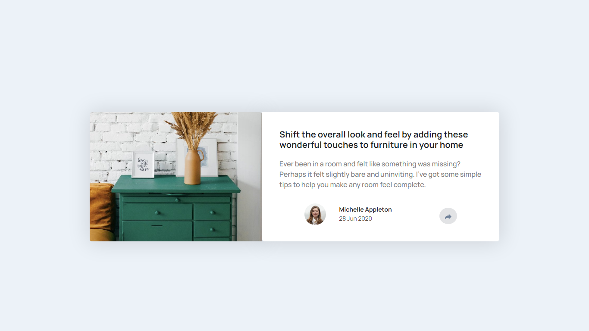

<h1>Article preview component solution</h1>

This is my solution to the [Article preview component challenge on Frontend Mentor](https://www.frontendmentor.io/challenges/article-preview-component-dYBN_pYFT).

</img>

- Solution URL: [Frontend Mentor]()
- Live Site URL: [GitHub]()

<h2>Built with</h2>

- Semantic HTML5 markup
- CSS custom properties
- Bootstrap
- Flexbox
- Mobile-first workflow